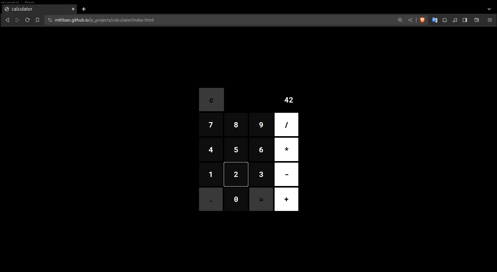
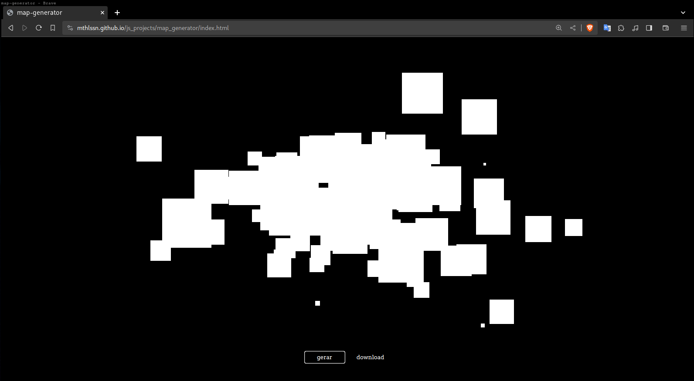
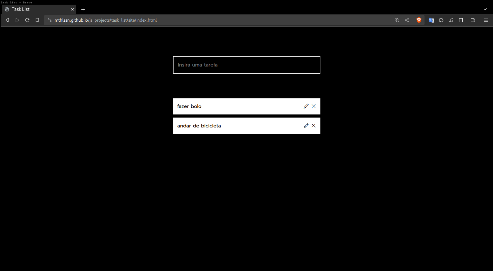

# js_projects
Todos esses projetos foram criados utilizando javascript.

<br>

## Calculator



### O quê é?

Uma calculadora web que realiza as 4 operações básicas.

### Como usar?

Acesse o [site](mthlssn.github.io/js_projects/)

<br>

## Map Generator



### O quê é?

Um gerador aleatório de mapas que permite o download da imagem gerada.

### Como usar?

Acesse o [site](mthlssn.github.io/js_projects/).

<br>

## Task List



### O quê é?

Uma lista de tarefas online que segue todo padrão de criação de um projeto node. Video do projeto funcionando em localhost: [link](https://www.youtube.com/watch?v=Qy_VtRfyFpg).

### Como usar?

Acesse o [site](https://mthlssn.github.io/js_projects/task_list/site/index.html) (versão sem banco de dados).

Para testar o projeto real em sua máquina siga o tutorial:

1. *Clone o repositório*:
   ```
      git clone https://github.com/mthlssn/js_projects.git
   ```

2. *Instale as dependências*:

   - Abra o terminal na pasta "task_list" e execute o seguinte comando:

   ```
   nmp i
   ```

   Caso não tenha ou conheça node, veja esse [video](https://www.youtube.com/watch?v=7iSylg2UvU0).

3. *Altere .ENV*:

   Na pasta do projeto, renomeou o arquivo ".env.exemple" para ".env" e preencha as variáveis.

   - PORT: 3000

   - BD_URL: Para ter a URL de seu banco de dados MongoDB assista a esse [vídeo](https://www.youtube.com/watch?v=aJAQF-shEyM&t=162s).

4. *Execute*:
  
   No terminal da pasta do projeto rode o comando:

   ```
   npm run dev
   ```

   Abra seu navegador e entre no [link](http://localhost:3000/).

